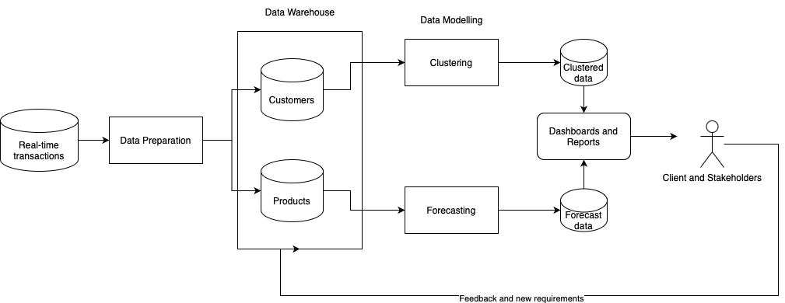

# BIT 5524 Conceptual Project Submission
This is a reference repository for the Conceptual Project Proposal submission for BIT 5524 course. This repository contains the sample data for the client, Jupyter notebook files for processing and modelling the data, and the pipeline overview for the project

## Set-up
  1. Go to your project directory
  2. Set up a virtual environment (.venv)
  3. Run this following command
    
         pip install pandas numpy scikit-learn plotly openpyxl matplotlib

## Proposed Project Pipeline

